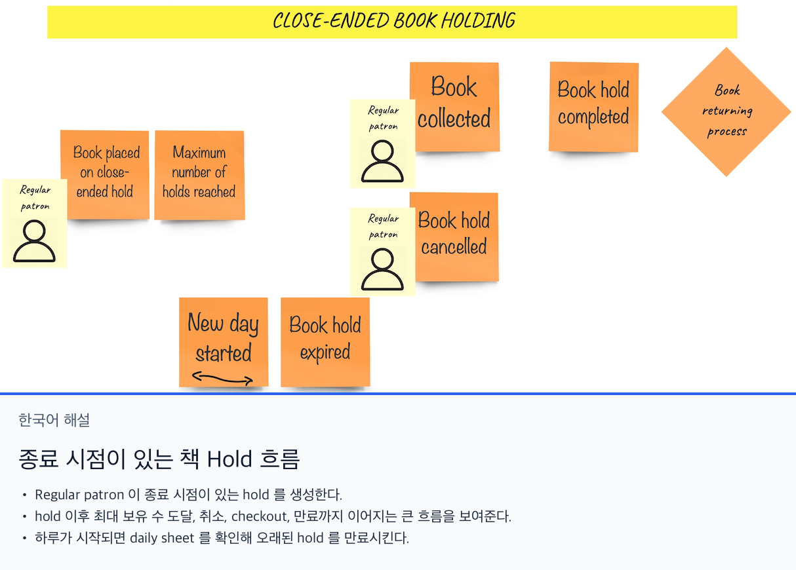
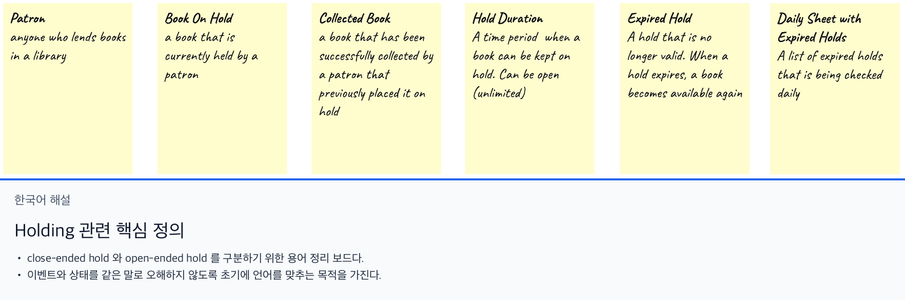
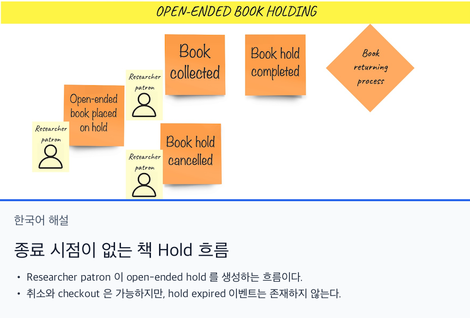
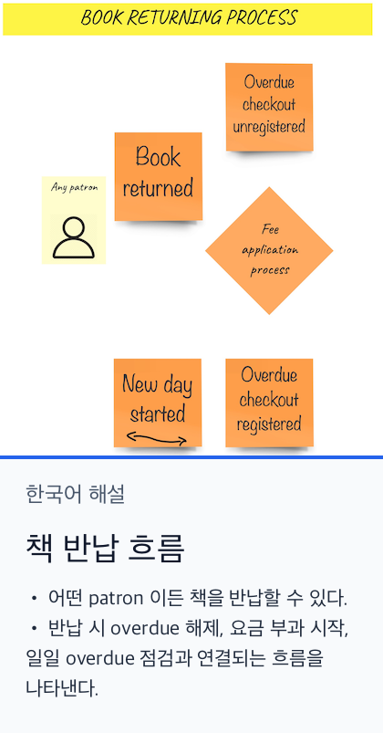
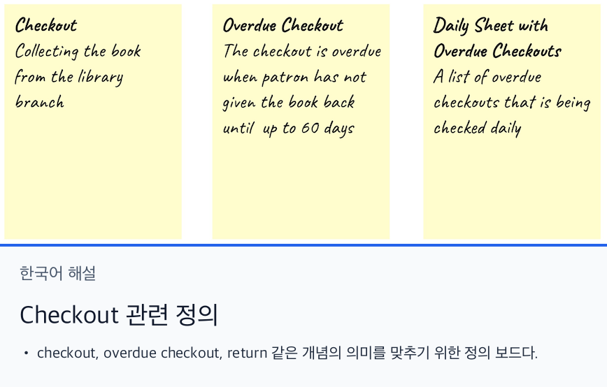
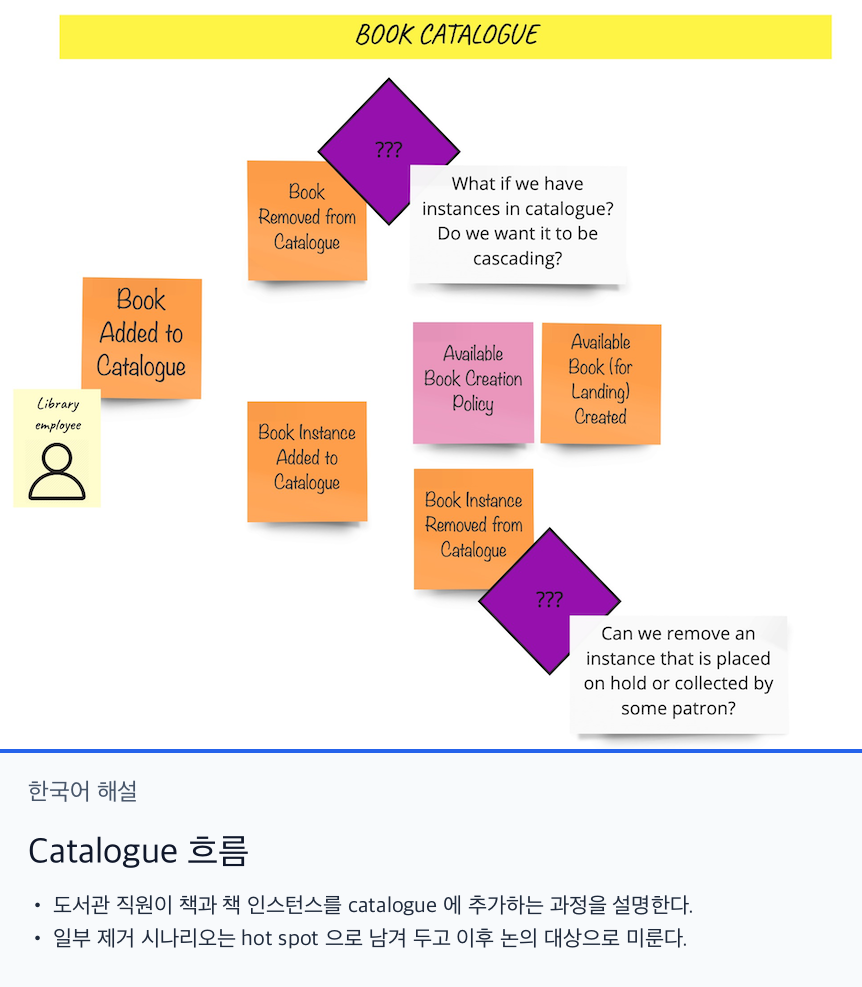
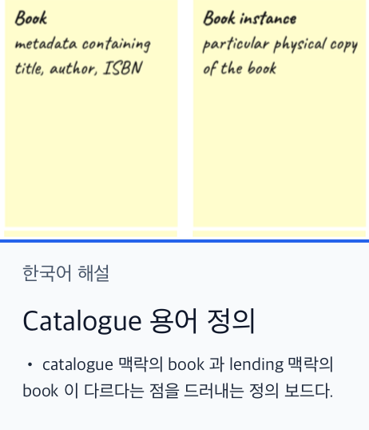

# Big Picture EventStorming

우리는 포스트잇과 펜으로 도메인 탐색을 시작했다. 가장 먼저 드러난 것은 **종료 시점이 있는 책 hold 프로세스(close-ended book holding)** 였다.

간단히 따라가 보면 다음과 같다.

- **Regular Patron** 은 **종료 시점이 있는 hold** 를 걸 수 있다
- **Regular Patron** 은 **hold 를 건 뒤** 최대 hold 수에 도달할 수 있다
- **Regular Patron** 은 hold 를 **취소**하거나 책을 **checkout** 할 수 있다
- 책이 **checkout** 되면 hold 는 **완료**되고, 그 다음으로 **반납 프로세스**가 시작된다
- 하루가 시작될 때마다 **daily sheet** 를 확인해 hold 가 너무 오래 유지되고 있지 않은지 본다. 그렇다면 **book hold expired** 가 발생한다

큰 흐름만 보면 이제 프로세스는 명확해 보인다. 하지만 포스트잇 위의 단어를 모두가 똑같이 해석한 것은 아니었다. 그래서 몇 가지 정의를 먼저 맞추기로 했다.

비슷한 발견은 **종료 시점이 없는 hold(open-ended book holding)** 프로세스에서도 나왔다.

- **Researcher Patron** 은 **종료 시점이 없는 hold** 를 걸 수 있다
- **Researcher Patron** 은 hold 를 **취소**하거나 책을 **checkout** 할 수 있다
- 책이 **checkout** 되면 hold 는 **완료**되고, 그 다음으로 **반납 프로세스**가 시작된다
- **종료 시점이 없는 hold** 에서는 **hold expired** 이벤트가 없다. 즉 hold 는 만료되지 않는다

좋다. 이 두 프로세스는 매우 비슷하다. 둘이 공통으로 가지는 영역이 하나 있는데, 아직은 거의 아무것도 모르는 부분이다. 그것이 바로 **책 반납 프로세스(book returning process)** 다.

이 그림을 문장으로 풀면 다음과 같다.

- **어떤 Patron 이든** 책을 **반납**할 수 있다
- **checkout 이 overdue 상태**였다면, 책이 **반납되는 즉시** overdue 등록은 해제된다
- **책을 반납하는 순간** 우리는 **요금 부과(fees application)** 프로세스를 시작한다
- 책이 **checkout** 된 이후 patron 이 제때 반납하지 않을 수 있다. 그래서 하루가 시작될 때마다 **daily sheet** 를 확인해 **overdue checkout** 을 찾아 등록한다

그런데 잠깐, 여기서 말하는 **checkout** 이란 정확히 무엇일까.

_- 좋아, 그럼 이제 fee application 프로세스가 뭔지 말해줘_  
_- 아니, 그건 지금은 중요하지 않아. 다음에 다시 보자_  
_- 잠깐, 왜? EventStorming 에서는 전체 그림을 다 봐야 하는 거 아니야?_  
_- 맞아. 하지만 시간에도 비용이 있어. 항상 지금 시점에서 가장 중요한 비즈니스 부분에 집중해야 해. 다음 워크숍에서 다시 다루겠다고 약속할게._  
_- 좋았어._  

이제 근본적인 질문이 하나 생긴다. _이 책들은 어디서 오는가?_ 도메인 설명을 다시 보면 **catalogue** 라는 개념이 있다. 그래서 우리는 그것도 모델링했다.

여기서 일어나는 일은 다음과 같다.

- **도서관 직원**은 책을 catalogue 에 추가할 수 있다
- 특정 **book instance** 도 추가할 수 있고, 이를 통해 아직 구체화되지 않은 어떤 정책 아래에서 그 책이 **available** 해질 수 있다
- **Book removed from catalogue** 와 **Book instance removed from catalogue** 는 둘 다 **hot spot** 으로 표시했다. 실제로 문제가 되는 부분이었고, 답은 나중으로 미뤘다

이 단순한 **catalogue** 흐름 안에서도 흥미로운 점이 하나 보인다. 여기의 **book** 은 앞서 다른 프로세스들에서 보았던 **book** 과 같은 의미가 아니다. 이를 분명히 하기 위해 새로운 정의를 봤다.

이런 차이를 포착하면 언어적 경계를 그릴 수 있다. 이것은 **bounded context** 를 정의할 때 유용한 휴리스틱 중 하나다. 이 시점부터 우리는 최소한 두 개의 **bounded context** 가 있다고 볼 수 있다.

- **lending**: hold, checkout, return 을 포함해 책 대출과 논리적으로 연결된 모든 비즈니스 프로세스를 담는 컨텍스트
- **catalogue**: 책과 그 인스턴스를 분류하고 등록하는 컨텍스트

__bounded context 를 어떻게 정의했는지에 대한 더 자세한 설명은 이후 추가될 예정이다__

대체로 여기까지가 첫 번째 _Big Picture EventStorming_ 반복의 결과였다. 이 과정을 통해 우리는 도서관 프로세스가 큰 그림에서 어떻게 동작하는지 이해하게 되었고, 무엇보다도 잘 정리된 정의와 초기 **bounded context** 를 포함한 **ubiquitous language** 를 얻었다.
