# Design Level EventStorming

예시를 문서로 정리하고 나자, 각 예시를 깊이 파고들며 시스템과의 핵심 상호작용을 식별하고, 비즈니스 규칙을 드러내고, 모델을 계속 다듬을 수 있게 되었다. 아래 섹션들에는 Design Level EventStorming 으로 모델링한 예시들이 정리되어 있다.

## Holding
### Regular patron

첫 번째 예시는 _regular patron 이 6번째 hold 를 시도하는 경우_ 다.

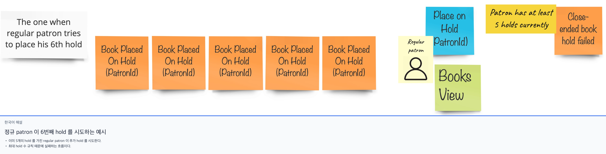

여기서 가정하는 것은 특정 patron 이 이미 5권의 책을 hold 하고 있다는 점이다. 여기에 하나를 더 hold 하려면 patron 은 어떤 방식으로든 _시스템_ 과 상호작용해야 한다. 그래서 **place on hold** 라는 command 를 나타내는 파란 포스트잇이 등장한다. 이런 결정을 내리기 위해 patron 은 hold 후보가 될 수 있는 책의 어떤 뷰를 봐야 한다. 그래서 초록 포스트잇이 있다. regular patron 은 5권을 초과해 hold 할 수 없기 때문에, **Book hold failed** 이벤트가 발생하는 조건을 설명하는 규칙도 식별할 수 있었다.

좋다. 계속 가보자.

현재 이용 불가능한 책에 patron 이 hold 를 시도하면, 아래 그림처럼 **book hold failed** 이벤트가 발생해야 한다.

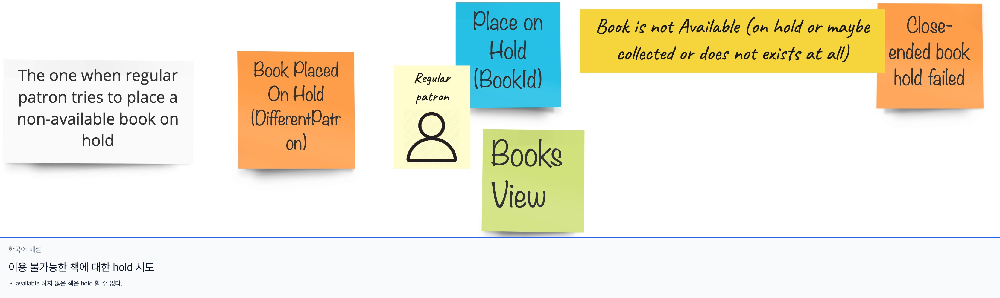

도메인 설명을 다시 보면, 각 patron 은 최대 2개의 **overdue checkout** 만 가질 수 있다. 이 조건을 넘긴 상태라면 **place a book on hold** 는 항상 실패해야 한다.

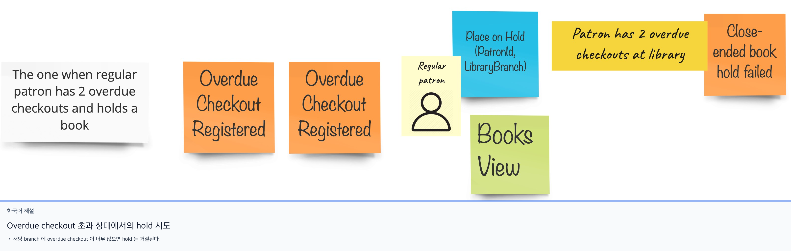

**regular patron** 의 또 다른 특징은 **restricted book** 을 hold 할 수 없다는 점이다.

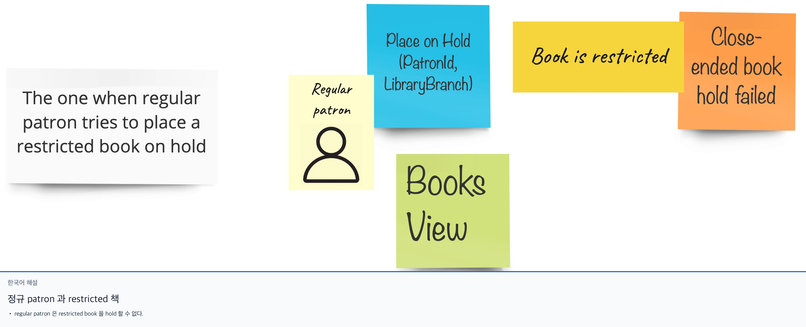

그리고 **regular patron** 에게 허용되지 않는 두 번째 것은 **open-ended hold** 다.

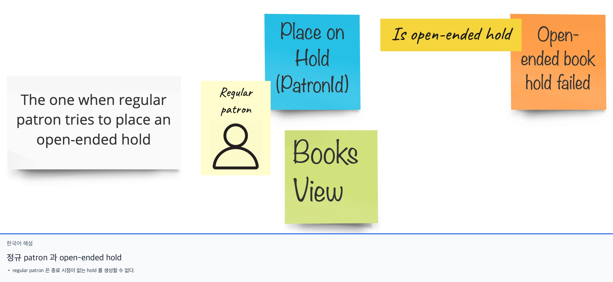

실패 사례는 이쯤 하고, 이제 patron 이 실제로 책을 빌릴 수 있게 해보자.

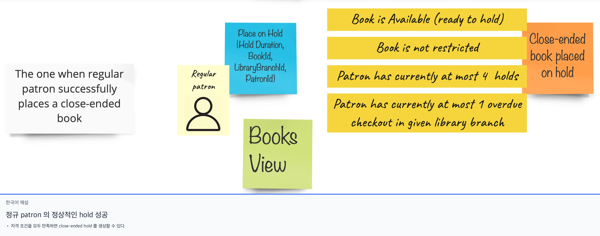

앞선 예시들을 종합해 보면, **patron** 이 **place a book on hold** 를 성공시키기 위해 충족해야 하는 조건은 다음과 같다.

- 책은 available 해야 한다
- 책은 **restricted** 이면 안 된다
- hold 를 걸려는 시점에 patron 의 hold 수는 5개 미만이어야 한다
- patron 의 overdue checkout 수는 2개 미만이어야 한다

그리고 마지막 예시는 이전에 부분적으로 다뤘던 시나리오를 포함한다.

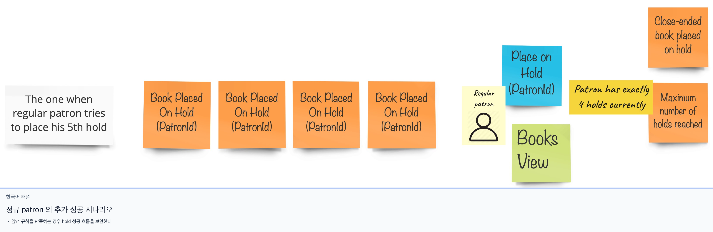

### Researcher patron

앞 절에서는 *regular patron* 만 살펴봤다. 이제 *researcher patron* 을 보자. 도메인 설명에 따르면 **어떤 patron 이든** 2개를 초과하는 **overdue checkouts** 가 있으면 hold 를 시도할 때 거절된다. 그래서 이 시나리오도 모델링했다.

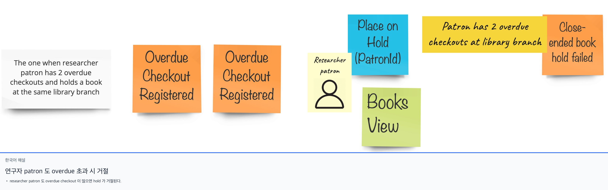

책이 **available 하지 않은** 경우 역시 예외가 없다.

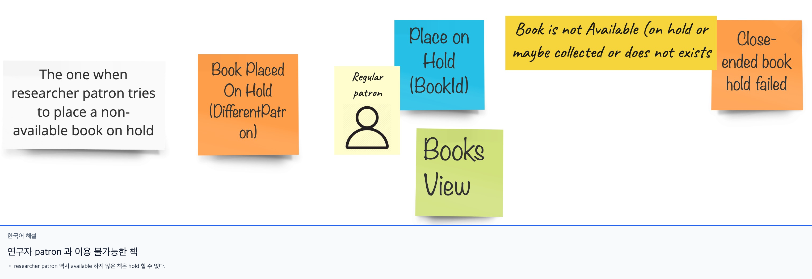

**researcher patron** 이 **regular patron** 과 다른 점은 **restricted** 책도 hold 할 수 있다는 것이다.

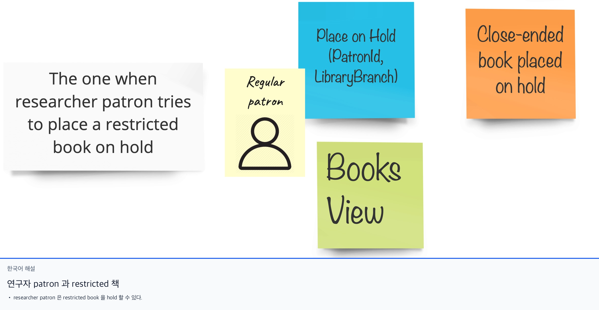

마지막 세 예시는 researcher patron 의 성공적인 hold 시나리오들이다.

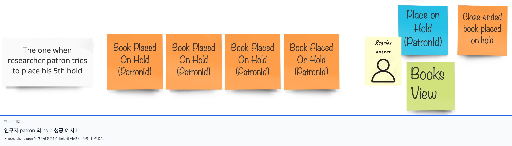
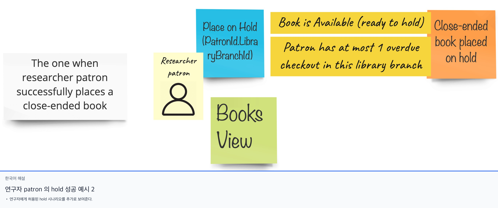
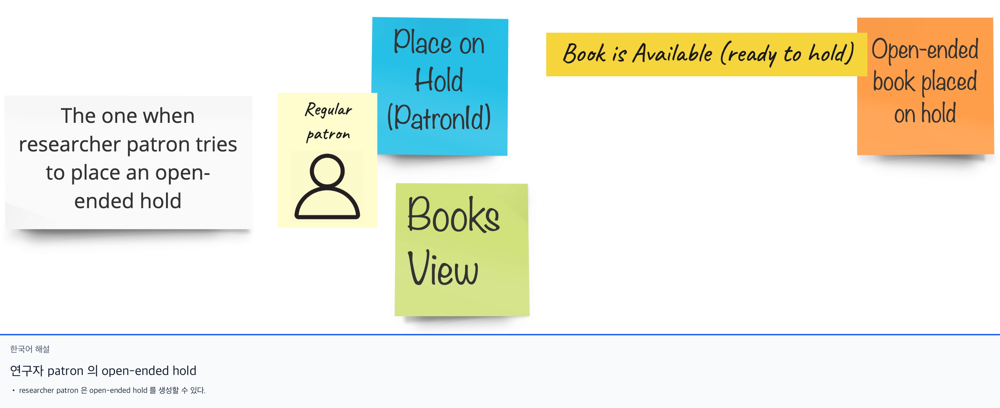

## Canceling a hold

어떤 patron 이든 hold 를 취소할 수 있다. 단, 절대 깨지면 안 되는 조건이 하나 있다. 바로 그 hold 가 실제로 존재해야 한다는 점이다. 그렇지 않으면 **book hold cancelling failed** 이벤트가 발생한다. 여기서 볼 수 있는 것은, patron 이 hold 를 취소하려면 현재 hold 목록을 볼 수 있는 어떤 뷰가 필요하다는 점이다. 그래서 **Holds view** 라는 초록 포스트잇이 등장한다.

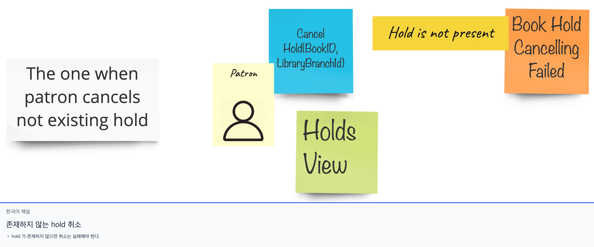

hold 가 존재한다면 취소할 수 있어야 한다.

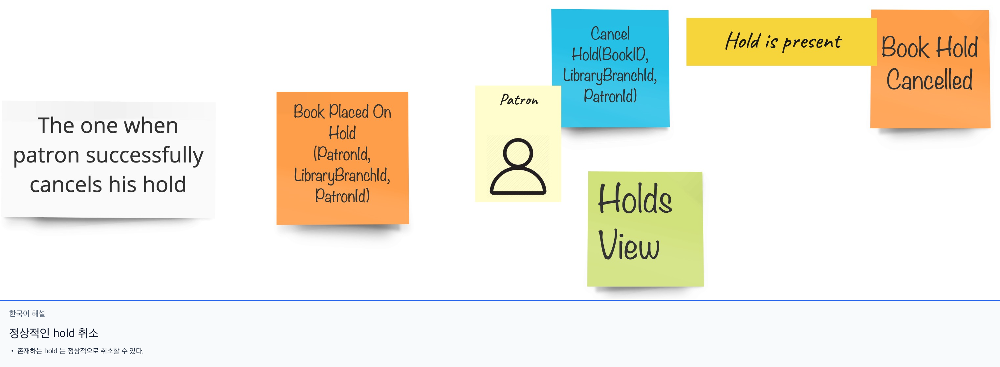

또 하나 고려해야 할 것은, **patron** 이 실제로는 자신이 걸지 않은 hold 를 **cancel** 하려는 경우다.

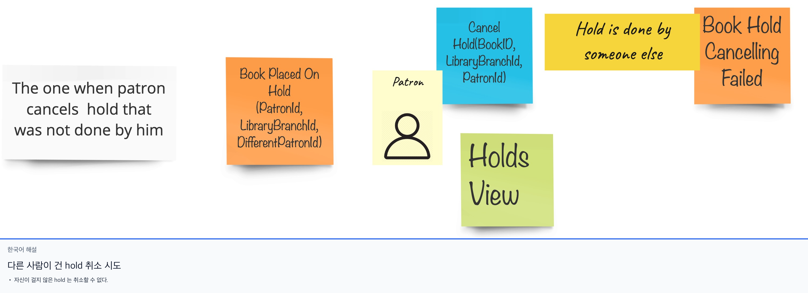

같은 hold 를 두 번 **cancel** 하는 것도 허용되어서는 안 된다.

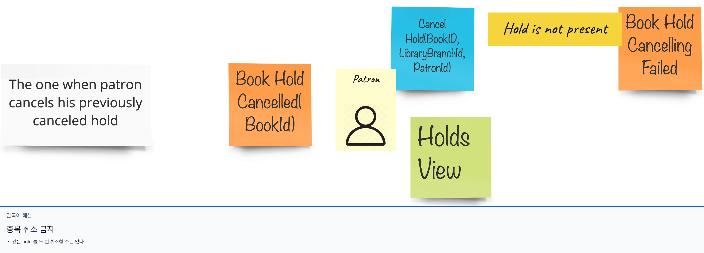

이제 다시 holding 관련 예시와 hold 취소를 연결해 보자. 각 **patron** 은 어느 시점이든 최대 5개의 hold 만 가질 수 있다. 따라서 그중 하나를 취소하면 다른 책 하나를 추가로 **place on hold** 할 수 있어야 한다.

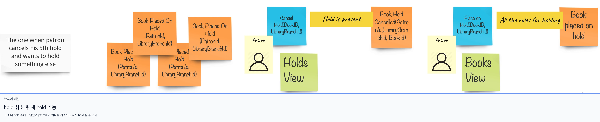

## Checkout

Checkout 은 도서관 운영의 핵심이라고 할 수 있다. **어떤 patron 이든** hold 된 책을 checkout 할 수 있지만, 그 전제는 반드시 **hold 가 존재해야 한다**는 것이다.

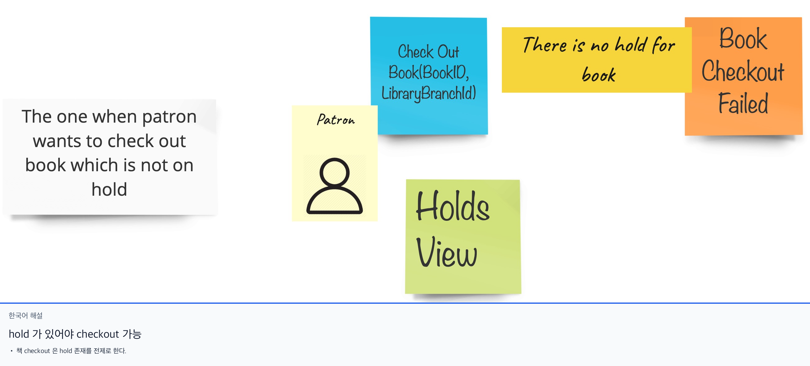

다른 patron 이 hold 한 책을 checkout 하는 것은 허용되지 않는다.

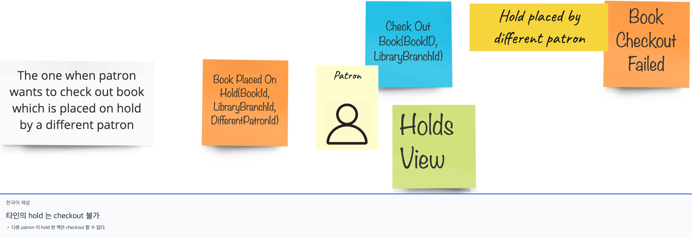

전체 흐름을 요약하는 예시는 아래와 같다.

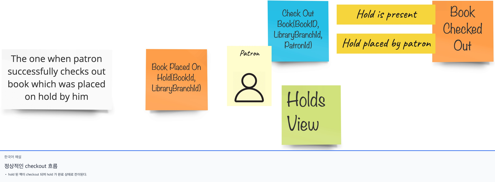

현실에서는 patron 이 hold 를 취소한 뒤 다시 checkout 하려고 할 수도 있다.

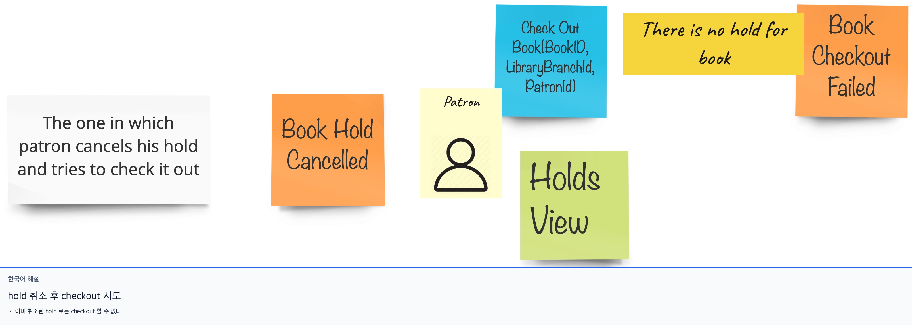

또 한편으로는 patron 에게 hold 는 있지만, 정작 도서관에는 책이 없는 상황도 생길 수 있다.

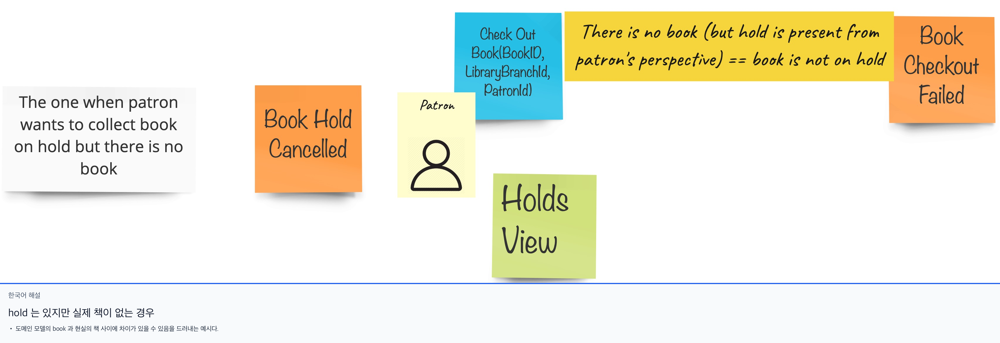

## Expiring a hold

도메인 설명에 따르면 **종료 시점이 있는 hold** 는 patron 이 checkout 하거나 만료될 때까지 활성 상태다. 만료 여부는 시스템이 하루 시작 시 자동으로 검사한다. 만료 대상 hold 를 찾으려면 시스템은 그런 항목들을 담은 read model 이 필요하다. 도메인 설명에서는 이것을 **Daily sheet** 라고 부른다.

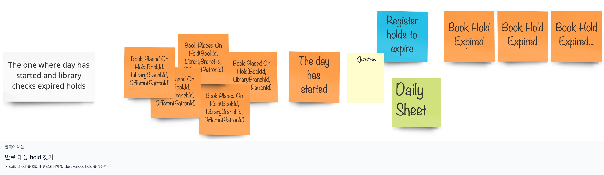

책이 **placed on hold** 된 뒤, 만료 시점 전에 hold 가 **cancelled** 되었다면 그 항목은 expired hold 로 등록되면 안 된다.

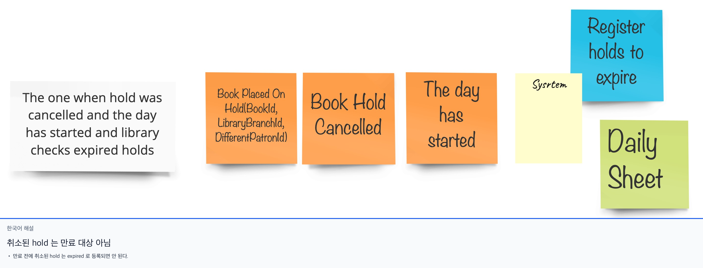

만료 검사에서는 각 hold 가 한 번만 expired 로 표시되어야 한다.

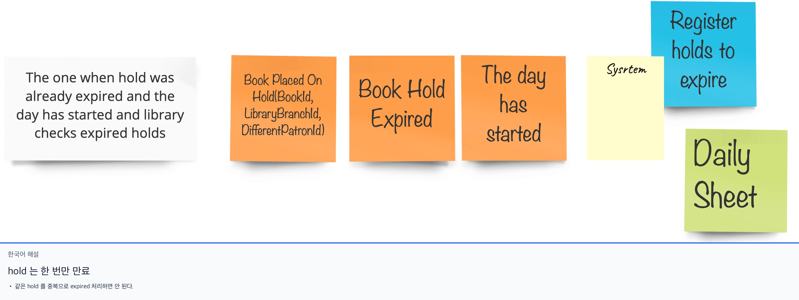

## Registering overdue checkout

각 책은 최대 60일까지만 checkout 할 수 있다. **Overdue checkouts** 는 하루 단위로 **Daily sheet** 를 조회해서 식별한다.

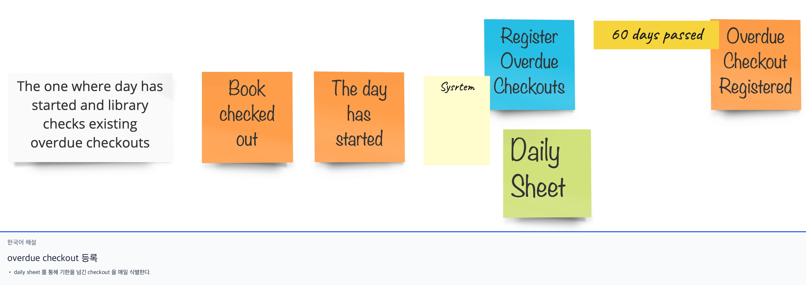

또한 이미 **returned** 된 책이 **overdue checkout** 으로 등록되는 일은 없어야 한다.

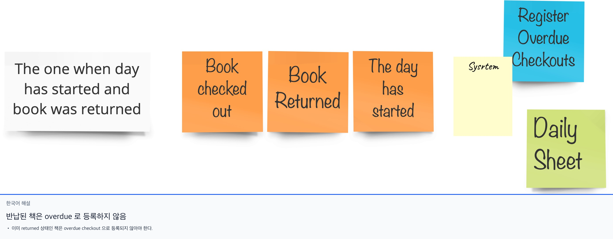

## Adding to catalogue

마지막 분석 영역은 책 **catalogue** 다. Catalogue 는 책과 그 인스턴스의 집합이다. 책 인스턴스는 먼저 같은 ISBN 을 가진 책이 catalogue 에 등록되어 있어야만 추가할 수 있다.

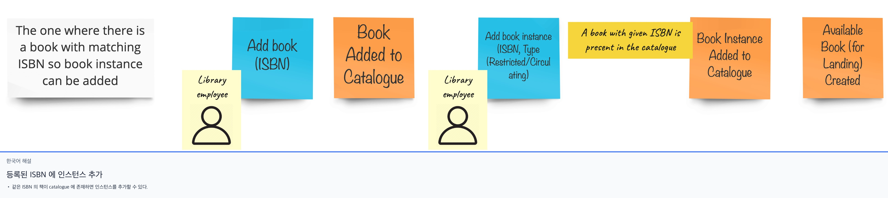

그렇지 않다면 책 인스턴스 추가는 실패해야 한다.

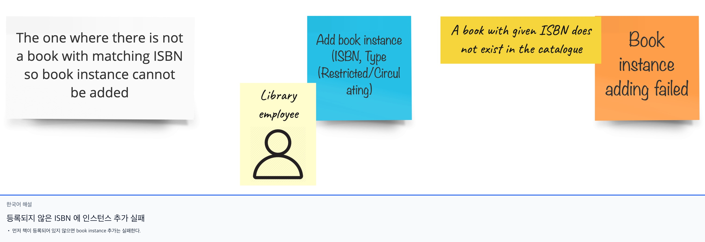

## Bounded Context Classification

지금까지 우리는 이미 두 개의 **bounded context** 를 식별했다. 바로 **lending context** 와 **catalogue context** 다. 도메인 설명과 발견된 비즈니스 규칙의 양을 함께 보면, **lending context** 쪽이 훨씬 더 많은 주의가 필요하다는 것을 알 수 있다. 두 컨텍스트의 비즈니스 복잡도를 비교한 결과, **lending context** 에는 **DDD의 tactical building blocks** 와 **hexagonal architecture** 를 적용하는 것이 타당하다고 판단했다. 반면 **catalogue context** 는 사실상 단순한 **CRUD** 에 가깝기 때문에 같은 수준의 로컬 아키텍처를 적용하는 것은 과설계가 된다.

여기서 이런 질문이 나올 수 있다. __어떻게 **catalogue context** 가 CRUD 라는 것을 알 수 있을까?__ 하나의 휴리스틱이 있다. 과거형 동사로 이름 붙은 이벤트들의 대부분이 같은 뜻의 명령형 command 에 직접 대응된다면, 우리는 아마 어떤 객체를 생성, 수정, 삭제하는 일을 하고 있을 가능성이 크다. 여기에 더해 특별한 비즈니스 규칙이 거의 없다면, 비즈니스에서 오는 본질적 복잡성이 낮아서 CRUD 가 잘 맞는 영역일 수 있다.

## Aggregates

위 예시들에서는 어떤 **aggregate** 가 command 를 처리하고 event 를 발생시킬지까지는 아직 정하지 않았다. 이런 접근은 특정 구현 언어나 해법에 너무 빨리 끌려 들어가는 것을 막아 준다. 먼저 행동과 책임을 보면 문제를 더 잘 이해할 수 있고, 그 결과 aggregate 의 더 적절한 이름을 찾을 수 있다. 이 절에서는 최종 aggregate 모델이 어떻게 정리되었는지 설명한다.

첫 번째 시도는 **Book** 을 aggregate 로 보는 것이었다. 우리는 __책을 hold 한다__, __책의 hold 를 취소한다__, __책을 checkout 한다__ 라고 자연스럽게 말한다.

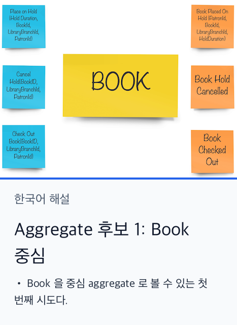

가장 먼저 떠오른 질문은 이것이었다. __invariant 가 정말 book 에 적용되는가?__ 꼭 그렇지만은 않았다. 앞에서 발견한 규칙들을 다시 보면 다음과 같은 것들이 있다.

- patron 이 **regular** 인가, **researcher** 인가
- patron 의 최대 hold 수에 도달했는가
- patron 의 overdue checkout 수가 한도를 넘었는가
- 책이 available 한가
- 책이 restricted 인가

책의 availability 와 restriction 도 중요하지만, 그보다 patron 과 관련된 규칙이 훨씬 많고 더 핵심적이었다.

그렇다면 왜 그냥 **Patron** 객체를 **Book** 메서드에 넘기지 않을까.

```java
book.placeOnHoldBy(patron);
```

물론 가능하다. 하지만 더 많은 invariant 를 알고 있는 쪽은 **patron** 이다. 우리는 그 invariant 를 다른 객체가 대신 보호하게 두고 싶지 않았다. 그래서 대안을 생각하게 된다.

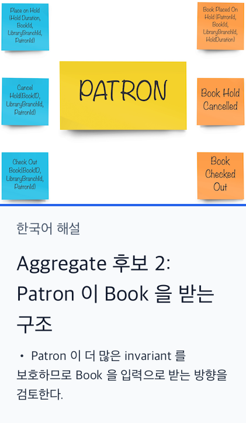

이제 예를 들어 __place a hold__ 를 하려면 **Book** 객체를 **Patron** 에 넘겨야 한다.

```java
patron.hold(book);
```

그런데 patron 의 invariant 와 book 의 invariant 가 모두 통과하면 patron 과 book 두 aggregate 를 모두 수정해야 한다. 그러면 하나의 transaction 안에서 서로 다른 aggregate 두 개를 수정하는 셈이 된다. 게다가 한 가지 더 있다. book 의 invariant, 특히 availability 는 우리 시스템이 보장하는 절대 진실이라기보다 "가장 그럴 것 같은 상태"에 가깝다. 왜냐하면 현실의 도서관에서는 hold 가 걸린 책이 중간에 훼손되거나 분실될 수도 있기 때문이다. 반면 patron 의 invariant 는 우리 시스템이 관리하는 쪽에 더 가깝고, 실제 상태일 가능성도 높다. hold 수, overdue checkout 수 같은 지표는 시스템이 비교적 정확하게 추적할 수 있다.

이 말은 결국 aggregate 간 통신에 **eventual consistency** 모델을 적용해도 괜찮다는 뜻이 된다. 오히려 그렇게 하는 편이 모델을 더 현실적으로 만들 수 있다. 클래스는 더 작아지고, 작업과 유지보수도 쉬워진다.

이제 aggregate 는 두 개가 되었다. 그리고 *Patron* 을 먼저 수정하고, **Book** 은 나중에 일관성을 맞추는 방향이 더 타당하다는 결론에 도달했다. 우리는 이미 **Book** 이 현실 세계의 책에 대한 투영이라는 점, 그리고 patron 이 더 많고 더 중요한 invariant 를 가진다는 점을 보았다. 실제로는 available 하지 않은 책에 hold 를 거는 일이 발생하고 나중에 보정하는 편이, overdue checkout 이 있는 patron 에게 hold 를 허용해 버리는 것보다 덜 해롭다고 볼 수도 있다.

결국 최종 모델은 아래와 같다.

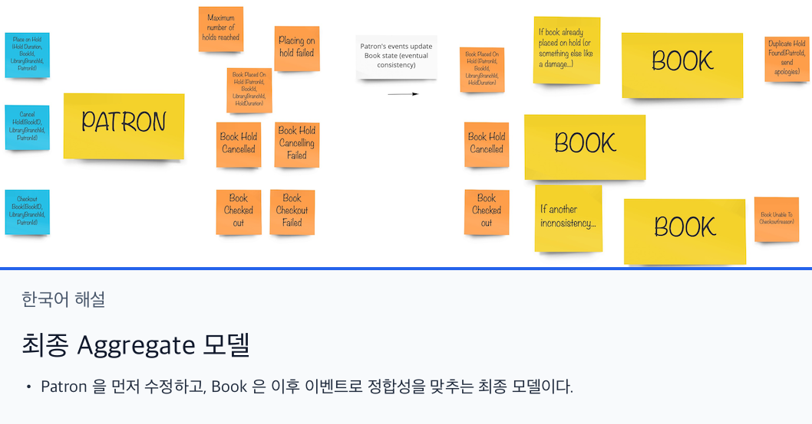
