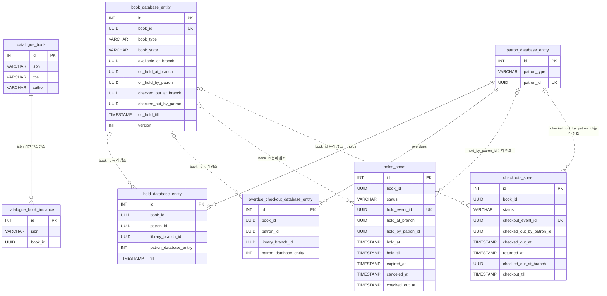

# ERD

## 목적

이 문서는 현재 프로젝트의 데이터 저장 구조를 빠르게 이해하기 위한 ERD 문서다.

중요한 점은, 이 프로젝트의 스키마는 관계형 데이터베이스 제약을 강하게 활용하는 방식이 아니라는 것이다.
즉 아래 다이어그램은 다음 두 가지를 함께 표현한다.

- 실제 테이블 구조
- 도메인 관점에서 추론되는 논리적 관계

따라서 아래 ERD는 "엄격한 FK 기반 관계도"라기보다, "현재 스키마를 이해하기 위한 구조도"로 보는 것이 맞다.

## 전체 ERD

## 읽는 법

이 ERD는 크게 세 영역으로 나눠서 읽으면 된다.

### 1. Catalogue 영역

- `catalogue_book`
- `catalogue_book_instance`

이 영역은 책과 책 인스턴스를 등록하는 컨텍스트다.
핵심은 ISBN, 제목, 저자, 인스턴스 식별 정보다.

### 2. Lending 영역

- `book_database_entity`
- `patron_database_entity`
- `hold_database_entity`
- `overdue_checkout_database_entity`

이 영역은 실제 대여 도메인의 상태를 저장한다.

- `book_database_entity`는 책의 대여 상태를 저장한다
- `patron_database_entity`는 patron의 타입을 저장한다
- `hold_database_entity`는 patron이 가진 hold를 저장한다
- `overdue_checkout_database_entity`는 overdue checkout 상태를 저장한다

### 3. Read Model 영역

- `holds_sheet`
- `checkouts_sheet`

이 영역은 읽기 모델이다.
즉 aggregate의 원천 상태를 저장하기보다, 조회와 운영 목적에 맞는 projection을 저장한다.

## 테이블별 해석

### `catalogue_book`

책의 서지 정보 저장소다.

- ISBN
- title
- author

이 테이블은 catalogue 맥락의 book 을 표현한다.

### `catalogue_book_instance`

실제 대출 단위가 되는 책 인스턴스를 저장한다.
같은 ISBN 아래 여러 인스턴스가 존재할 수 있다.

### `book_database_entity`

lending 맥락의 책 상태 저장소다.
여기서는 책이 단순 서지 정보가 아니라 `대여 가능한 자원`으로 표현된다.

핵심 컬럼:

- `book_type`
  - `Circulating` / `Restricted`
- `book_state`
  - 현재 lending 상태
- `on_hold_by_patron`
- `checked_out_by_patron`
- `on_hold_till`

### `patron_database_entity`

도서관 이용자 저장소다.

핵심 컬럼:

- `patron_type`
  - `Regular` / `Researcher`
- `patron_id`

### `hold_database_entity`

특정 patron 이 현재 가진 hold 기록이다.
`Patron` aggregate 복원에 필요한 재료 중 하나다.

### `overdue_checkout_database_entity`

특정 patron 의 overdue checkout 기록이다.
hold 자격 규칙 판단에 쓰인다.

### `holds_sheet`

daily sheet 및 patron profile 같은 읽기 모델을 위한 hold projection 이다.
현재 상태와 이력성 컬럼을 함께 가진다.

핵심 컬럼:

- `status`
- `hold_at`
- `hold_till`
- `expired_at`
- `canceled_at`
- `checked_out_at`

### `checkouts_sheet`

checkout projection 이다.
운영 조회와 읽기 모델 용도로 쓰인다.

핵심 컬럼:

- `status`
- `checked_out_at`
- `checkout_till`
- `returned_at`

## 왜 FK가 적은가

이 프로젝트는 관계형 제약을 강하게 거는 방식보다, 도메인 모델과 이벤트 흐름으로 정합성을 유지하는 쪽에 가깝다.

즉:

- DB는 상태 저장
- Java 도메인 코드는 정책 판단
- 이벤트는 다른 aggregate와 read model 동기화

이 방향 때문에 ERD만 보면 단순해 보이지만, 실제 비즈니스 규칙은 코드 쪽에 더 많이 존재한다.

## 이 ERD를 볼 때 주의할 점

이 문서만 보고 다음처럼 오해하면 안 된다.

- FK가 적으니 도메인도 단순하다
- 테이블 관계가 적으니 비즈니스 규칙도 적다
- `book_database_entity` 하나면 책 도메인을 다 설명할 수 있다

실제로는:

- 도메인 규칙은 `Patron`, `Book`, policy, event 로 분산되어 있고
- `holds_sheet`, `checkouts_sheet`는 source of truth 라기보다 projection 성격이 강하다

## 함께 보면 좋은 문서

- [domain-specification.md](./domain-specification.md)
- [ddd-study-guide.md](./ddd-study-guide.md)
- [big-picture.md](./big-picture.md)
- [design-level.md](./design-level.md)
