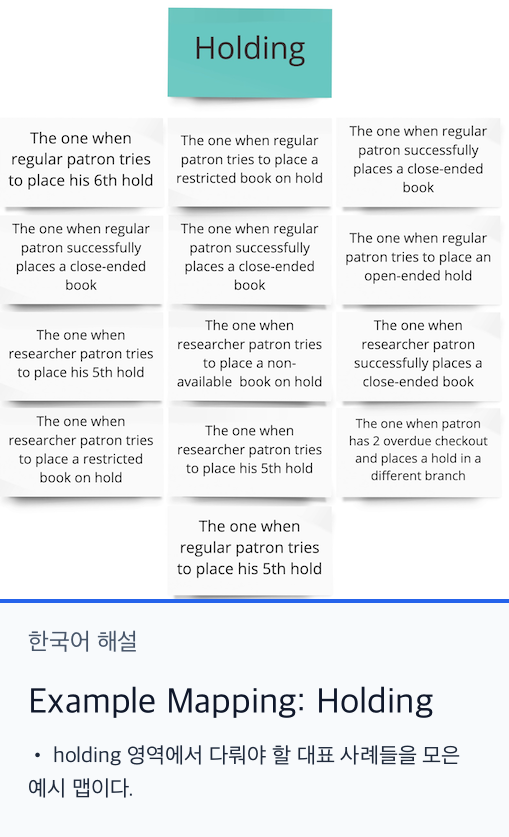
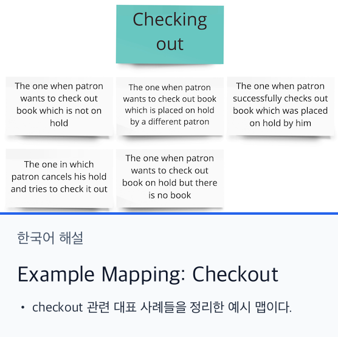
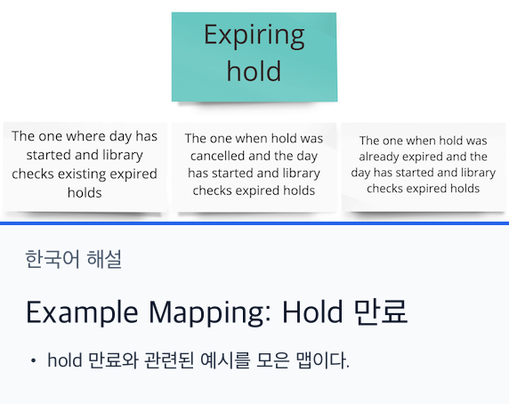
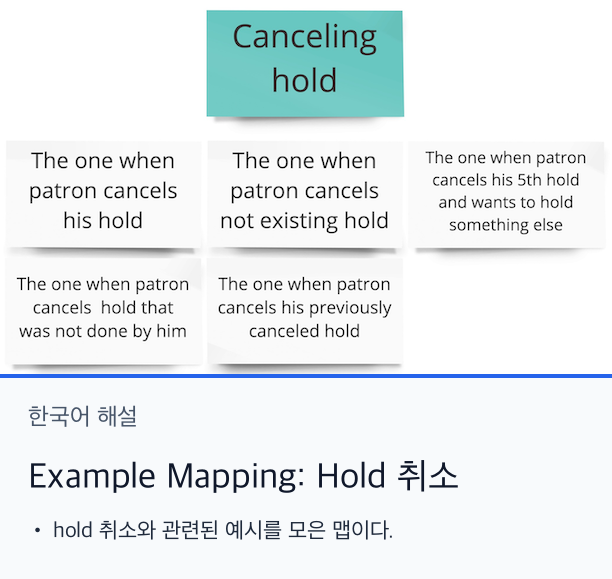
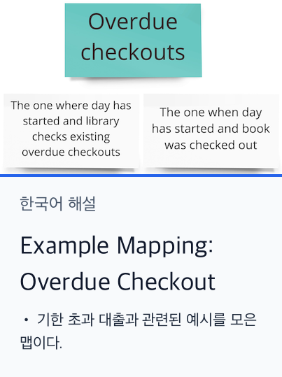
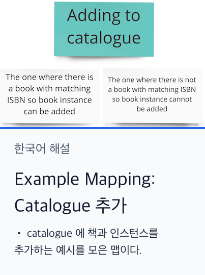

# Example Mapping

Big Picture EventStorming 이 끝난 뒤, 우리는 도메인을 높은 수준에서 개괄적으로 이해하게 되었다. 다음 단계는 곧바로 Design Level EventStorming 으로 들어가는 것일 수도 있었다. EventStorming 은 도구이기 때문에 상황에 맞게 형태를 바꿔 사용할 수 있다. 처음 Big Picture 세션에서 더 깊이 들어가서 이벤트, 정책, 규칙을 이용해 가능한 모든 경로와 시나리오를 바로 모델링할 수도 있었다.

하지만 그렇게 하면 개별 비즈니스 시나리오를 발견하고 우선순위를 정하기가 어려워질 수 있다. 시나리오들이 벽 전체에 흩어져 버리기 때문이다. 그래서 우리가 택한 대안은 먼저 시나리오를 발견하고, 그 다음 각 시나리오를 Design Level EventStorming 으로 따로 모델링하는 방식이었다. 그 중간 단계가 바로 Example Mapping 이다. 아래에는 그 세션의 결과를 정리했다.

_참고로 여기서는 원래 기법보다 단순화한 Example Mapping 을 사용했다. 규칙이나 유스케이스 중심으로 세밀하게 다루기보다, 비즈니스 영역별로 예시를 묶는 방식이다._

## Holding

## Checkout

## Expiring hold

## Canceling hold

## Overdue checkouts

## Adding to catalogue

